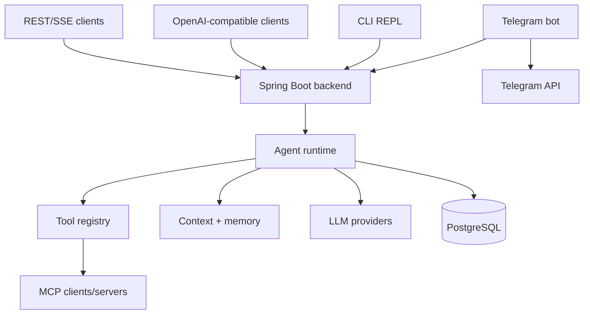

<p align="center">
  
</p>

<p align="center">
  <a href="#features"></a>
  <a href="#stack"></a>
  <a href="#api"></a>
  <a href="#boundaries"></a>
  <a href="#cli"></a>
  <a href="#architecture"></a>
  <a href="#license"></a>
</p>

<p align="center">
  
  
  
  
  
  
  
  
</p>

<p align="center">
  
  
  
  
</p>

---

## 🎯 Позиционирование

**Java Agent** — Java/Spring Boot agent platform для FerrPOINT: LLM runtime, OpenAI-compatible API, built-in tools, MCP client/server, Telegram gateway and standalone CLI REPL.

The project is an active product line. `AGENTS.md` is the canonical development guide; README is the clean public entry point.

## 📌 Snapshot

| Поле | Значение |
|---|---|
| Product line | `0.1.140` |
| Gradle artifacts | `0.0.1-SNAPSHOT` |
| Modules | `backend`, `telegram-bot`, `cli` |
| Runtime | Java 25 LTS, Spring Boot 4.1, Gradle 9.6.1 |
| Data | PostgreSQL 16, JPA/Hibernate, Flyway |
| AI/tooling | LangChain4j 1.18, MCP Java SDK 2.0, Repomix MCP, built-in tool registry |
| Interfaces | REST/SSE, OpenAI-compatible `/v1/*`, Telegram bot, CLI REPL |
| License | FerrPOINT Proprietary Source-Available Evaluation License v1.0 |

<a name="features"></a>
## ✨ Features

| Feature | Описание |
|---|---|
| Agent runtime | Sync and SSE chat, sessions, checkpoints, rollback and undo. |
| OpenAI-compatible API | Chat completions, streaming, models, capabilities and toolsets. |
| Built-in tools | File, terminal, web, browser, memory, skills, cron, delegation, TTS, image generation and vision. |
| Context engine | Compression, history sanitizing, replay cleanup and runtime settings. |
| Memory loop | Background review with approval gate and prompt injection for approved facts. |
| MCP | Client/server support, dynamic tool discovery and Repomix integration. |
| Telegram gateway | Streaming, media handling, model override, steer mode, busy-ack, group filters and inline keyboards. |
| CLI REPL | 92 slash commands, SSE streaming, JLine autocomplete and markdown rendering. |
| Deployment/test matrix | Production, local and E2E compose files, Flyway migrations and a large regression suite. |

<a name="stack"></a>
## 🔧 Core Stack

| Layer | Stack |
|---|---|
| Backend | Java 25, Spring Boot 4.1, Spring Framework 7, Spring Security, WebSocket, Actuator |
| Persistence | PostgreSQL 16, JPA/Hibernate, Flyway 12, Testcontainers |
| LLM/MCP | LangChain4j 1.18, OpenAI-compatible clients, MCP Java SDK 2.0, Repomix |
| CLI | Spring Boot, Picocli, JLine, ANSI Markdown renderer |
| Bot | Telegram Bot API client, polling/webhook paths, streaming/edit-message delivery |
| Codegen/helpers | Lombok, MapStruct, Jackson 3, Pebble templates, Resilience4j |

<a name="api"></a>
## 🔌 API

| Endpoint | Назначение |
|---|---|
| `POST /api/v1/agent/chat` | Sync chat |
| `POST /api/v1/agent/chat/stream` | SSE streaming chat |
| `POST /api/v1/agent/steer` | Inject message into an active run |
| `POST /v1/chat/completions` | OpenAI-compatible chat completions |
| `GET /v1/models` | Model list |
| `GET /v1/capabilities` | Machine-readable capabilities |
| `GET /v1/toolsets` | Toolsets and tools |
| `GET/POST /api/v2/sessions` | Session list/create |
| `GET /actuator/health` | Health check |

<a name="boundaries"></a>
## 🧱 Boundaries

- Production deployment must provide real model credentials, DB credentials, API keys and secret redaction settings.
- Browser, file, terminal and network tools require explicit operational policy before exposing outside trusted environments.
- `server.shutdown: immediate` is kept as a Spring Boot 4.1 workaround.
- Java/Gradle artifacts are packaged with proprietary license metadata; third-party dependencies remain under their own licenses.

<a name="cli"></a>
## 🖥️ CLI

Build jars:

```bash
./gradlew :backend:bootJar :telegram-bot:bootJar :cli:bootJar
```

Run backend:

```bash
cd backend
export OLLAMA_API_KEY=***
java -jar build/libs/backend-0.0.1-SNAPSHOT.jar \
  --spring.profiles.active=dev \
  --spring.datasource.password=project_workflow \
  --server.port=8090
```

Run a NoOp backend without LLM/PostgreSQL:

```bash
cd backend
java -jar build/libs/backend-0.0.1-SNAPSHOT.jar \
  --spring.profiles.active=noop \
  --server.port=8090
```

Run CLI:

```bash
cd cli
java -jar build/libs/cli-0.0.1-SNAPSHOT.jar --backend.url=http://localhost:8090
```

Streaming smoke:

```bash
curl -N -X POST http://localhost:8090/api/v1/agent/chat/stream \
  -H "Content-Type: application/json" \
  -d '{"message":"Привет"}'
```

OpenAI-compatible smoke:

```bash
curl -s -X POST http://localhost:8090/v1/chat/completions \
  -H "Content-Type: application/json" \
  -d '{"model":"kimi-k2.6","messages":[{"role":"user","content":"hi"}]}'
```

<a name="architecture"></a>
## 🏗️ Architecture



## 🚀 Deployment

```bash
docker compose -f docker-compose.prod.yml up --build
docker compose -f docker-compose.local.yml up --build
docker compose -f docker-compose.e2e.yml up --build
```

| Compose file | Назначение |
|---|---|
| `docker-compose.prod.yml` | Production-like stack on port `8080` with PostgreSQL `5432` |
| `docker-compose.local.yml` | Local dev stack on `18090`/`18091` |
| `docker-compose.e2e.yml` | E2E testing stack |

Docker images use `eclipse-temurin:25-jre-noble`; slim images install Chromium at runtime.

## 🛡️ Quality Bar

| Проверка | Команда |
|---|---|
| Full gate | `./gradlew check` |
| Module tests | `./gradlew :backend:test :telegram-bot:test :cli:test` |
| Slow integration | `./gradlew :backend:slowTest` |
| Coverage | `./gradlew jacocoTestReport` |

Slow tests use real PostgreSQL through Testcontainers; H2 remains only for selected offline/streaming tests.

## 🧭 Project Map

```text
java-agent/
├── backend/       # REST API, runtime, tools, MCP, persistence, services
├── telegram-bot/  # Telegram gateway, command handlers, streaming and media
├── cli/           # standalone REPL and REST client
├── docs/          # architecture, parity, audits and plans
├── backend/docs/  # production hardening, Chromium and streaming notes
├── repomix.config.json
├── docker-compose.prod.yml
├── docker-compose.local.yml
└── docker-compose.e2e.yml
```

## 📚 Документы

- [AGENTS.md](AGENTS.md) — canonical development guide and current project facts.
- [docs/README.md](docs/README.md) — documentation overview.
- [docs/01-scope.md](docs/01-scope.md), [docs/02-core-architecture.md](docs/02-core-architecture.md), [docs/03-dependency-map.md](docs/03-dependency-map.md) — scope and architecture.
- [docs/09-builtin-tools.md](docs/09-builtin-tools.md) — built-in tools.
- [docs/10-production-readiness.md](docs/10-production-readiness.md), [backend/docs/13-production-hardening.md](backend/docs/13-production-hardening.md) — hardening notes.
- [backend/docs/11-chromium.md](backend/docs/11-chromium.md), [backend/docs/12-streaming.md](backend/docs/12-streaming.md) — browser and streaming details.
- [backend/docs/conventions.md](backend/docs/conventions.md) — Lombok, records and MapStruct conventions.

<a name="license"></a>
## 🔒 License

Proprietary source-available. Not open source.

Viewing/evaluation only.

Commercial, production, resale, redistribution, SaaS/hosting use require written license from FerrPOINT. См. [LICENSE](LICENSE), [NOTICE](NOTICE) и [THIRD_PARTY_NOTICES.md](THIRD_PARTY_NOTICES.md).

<p align="center">
  
</p>
