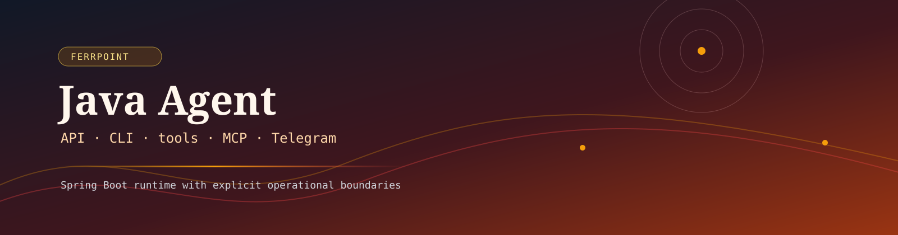
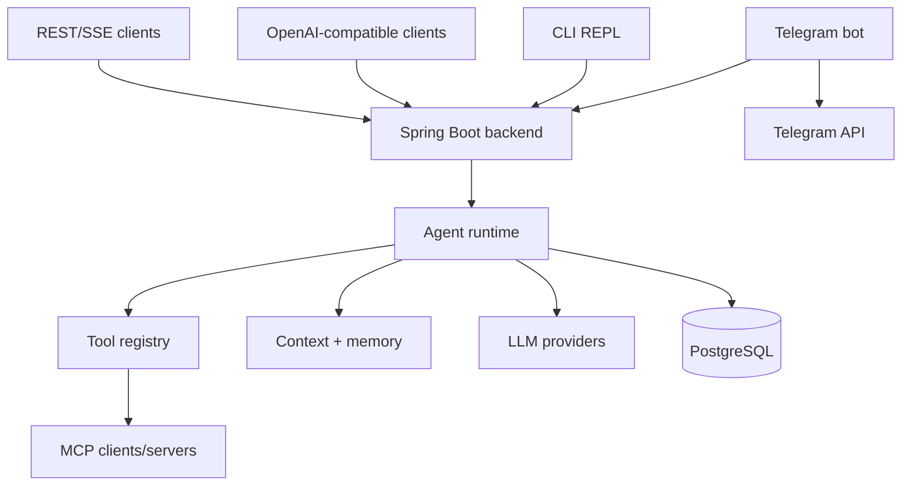

<p align="center">
  
</p>

<p align="center">
  <a href="#overview"></a>
  <a href="#capabilities"></a>
  <a href="#stack"></a>
  <a href="#api"></a>
  <a href="#cli"></a>
  <a href="#boundaries"></a>
  <a href="#quality"></a>
</p>

<p align="center">
  
  
  
  
  
  
  
  
</p>

<p align="center">
  
  
  
  
  
</p>

---

## 🎯 Позиционирование

**Java Agent** — Java/Spring Boot agent-платформа для FerrPOINT: LLM runtime, OpenAI-compatible API, built-in tools, MCP client/server, Telegram gateway и standalone CLI REPL.

`AGENTS.md` — канонический development guide; README — публичная точка входа.

<a name="overview"></a>

## 📌 Snapshot

| Поле | Значение |
|---|---|
| Модули | `backend`, `telegram-bot`, `cli` (+ `shared` DTO) |
| Runtime | Java 25 LTS, Spring Boot 4.1, Gradle 9.6.1 |
| Data | PostgreSQL 16, JPA/Hibernate, Flyway |
| AI/tooling | LangChain4j 1.18, MCP Java SDK 2.0, Repomix MCP, built-in tool registry |
| Interfaces | REST/SSE, OpenAI-compatible `/v1/*`, Telegram bot, CLI REPL |
| Base umbrella | API `7761`, PostgreSQL `7762` (loopback), Telegram gateway `7763`; management port network-internal |
| Тесты | 6221 (backend 4710 + bot 1511), 567 файлов, 0 падений |
| License | FerrPOINT Proprietary Source-Available Evaluation License v1.0 |

<a name="capabilities"></a>

## ✨ Features

| Feature | Описание |
|---|---|
| Agent runtime | Sync и SSE chat, sessions, checkpoints, rollback и undo. |
| OpenAI-compatible API | Chat completions, streaming, models, capabilities и toolsets. |
| Built-in tools | File, terminal, web, browser, memory, skills, cron, delegation, TTS, image generation и vision. |
| Context engine | Compression, history sanitizing, replay cleanup и runtime settings. |
| Memory loop | Background review с approval gate и prompt injection одобренных фактов. |
| MCP | Client/server, dynamic tool discovery и Repomix integration. |
| Telegram gateway | Streaming, media handling, model override, steer mode, busy-ack, group filters и inline keyboards. |
| CLI REPL | 92 slash-команды, SSE streaming, JLine autocomplete и markdown rendering. |
| Deployment/test matrix | Production, local и E2E compose-профили, Flyway migrations и большой regression suite. |

<a name="stack"></a>

## 🔧 Core Stack

| Layer | Stack |
|---|---|
| Backend | Java 25, Spring Boot 4.1, Spring Framework 7, Spring Security, WebSocket, Actuator |
| Persistence | PostgreSQL 16, JPA/Hibernate, Flyway 12, Testcontainers |
| LLM/MCP | LangChain4j 1.18, OpenAI-compatible clients, MCP Java SDK 2.0, Repomix |
| CLI | Spring Boot, Picocli, JLine, ANSI Markdown renderer |
| Bot | Telegram Bot API client, polling/webhook, streaming/edit-message delivery |
| Codegen/helpers | Lombok, MapStruct, Jackson 3, Pebble templates, Resilience4j |

<a name="api"></a>

## 🔌 API

| Endpoint | Назначение |
|---|---|
| `POST /api/v1/agent/chat` | Sync chat |
| `POST /api/v1/agent/chat/stream` | SSE streaming chat |
| `POST /api/v1/agent/steer` | Inject message в активный run |
| `POST /v1/chat/completions` | OpenAI-compatible chat completions |
| `GET /v1/models` | Model list |
| `GET /v1/capabilities` | Machine-readable capabilities |
| `GET /v1/toolsets` | Toolsets и tools |
| `GET/POST /api/v2/sessions` | Session list/create |
| `GET/POST /api/v1/admin/users` | Multi-user admin: create/list users |
| `POST /api/v1/admin/users/{id}/keys` | Issue per-user API key (raw key возвращается один раз) |
| `DELETE /api/v1/admin/users/keys/{keyId}` | Revoke an API key |
| `GET /health` | Safe runtime health summary |
| `GET /bot/health` (gateway) | Состояние процесса bot-сервиса; не end-to-end проверка Telegram API |

### Multi-user и аутентификация

- **Global key** (`agent.security.api-key`, env `API_SERVER_KEY`) — админ-доступ; когда пуст — auth выключен (dev-режим).
- **Per-user ключи** (`agk_…`) выдаются админом через `/api/v1/admin/users/{id}/keys`, хранится только SHA-256 fingerprint. Держатель ключа получает свою userId-область: сессии, память, cron, чекпойнты, usage; приватные скиллы других юзеров недоступны.
- **CLI**: ключ задаётся env `AGENT_API_KEY` (или `CLI_API_KEY`) и уходит заголовком `X-API-Key` на каждый запрос.
- Порядок включения: задать `API_SERVER_KEY` → создать админа/юзеров через REST (глобальным ключом) → выдать per-user ключи → раздать юзерам.

<a name="cli"></a>

## 🖥️ CLI

Build jars:

```bash
./gradlew :backend:bootJar :telegram-bot:bootJar :cli:bootJar
```

Run backend:

```bash
cd backend
java -jar build/libs/backend-0.0.1-SNAPSHOT.jar \
  --spring.profiles.active=dev \
  --server.port=8090
```

Run a NoOp backend без LLM/PostgreSQL:

```bash
cd backend
java -jar build/libs/backend-0.0.1-SNAPSHOT.jar \
  --spring.profiles.active=noop \
  --server.port=8090
```

Run CLI:

```bash
cd cli
java -jar build/libs/cli-0.0.1-SNAPSHOT.jar --backend.url=http://localhost:8090
```

Streaming smoke:

```bash
curl -N -X POST http://localhost:8090/api/v1/agent/chat/stream \
  -H "Content-Type: application/json" \
  -d '{"message":"Привет"}'
```

OpenAI-compatible smoke:

```bash
curl -s -X POST http://localhost:8090/v1/chat/completions \
  -H "Content-Type: application/json" \
  -d '{"model":"kimi-k2.6","messages":[{"role":"user","content":"hi"}]}'
```

CLI — отдельный Spring Boot модуль, не зависит от backend-кода и общается с ним через REST: REPL со slash-командами (`/new`, `/status`, `/compress`, `/undo`, `/checkpoint`, `/rollback`, `/memory`, `/skills`, `/help` и др.), SSE streaming и JLine autocomplete.

## 🏗️ Architecture



## 🚀 Deployment

```bash
# Dev runtime: immutable backend/bot images, остановка старых host-сервисов,
# изолированный unprivileged container stack на localhost:8090.
./scripts/deploy-dev-docker.sh

# Другие compose-профили
docker compose -f docker-compose.local.yml up --build
docker compose -f docker-compose.e2e.yml up --build
```

| Compose file | Назначение |
|---|---|
| `docker-compose.dev.yml` + `scripts/deploy-dev-docker.sh` | Dev runtime: isolated backend/bot containers на `127.0.0.1:8090`; reuses existing PostgreSQL |
| `docker-compose.prod.yml` | Production-like stack на порту `8080` с PostgreSQL `5432` |
| `docker-compose.local.yml` | Local dev fixture на `18090`/`18091` |
| `docker-compose.e2e.yml` | E2E testing stack |

Docker images используют `eclipse-temurin:25-jre-noble`; slim-образы ставят Chromium at runtime.

<a name="boundaries"></a>

## 🧱 Boundaries

- Production deployment обязан предоставить реальные model credentials, DB credentials, API keys и настройки secret redaction.
- Browser, file, terminal и network tools требуют явной operational policy до exposures за пределами trusted environments.
- `server.shutdown: immediate` сохраняется как workaround Spring Boot 4.1.
- Actuator readiness проверяет БД; LLM, browser и MCP availability — отдельные operational concerns и readiness не блокируют.
- Java/Gradle артефакты упаковываются с proprietary license metadata; сторонние зависимости остаются под своими лицензиями.

<a name="quality"></a>

## 🛡️ Quality Bar

| Проверка | Команда |
|---|---|
| Full local evidence | `python3 scripts/release_verify.py` |
| Module tests | `./gradlew :backend:test :telegram-bot:test :cli:test --no-daemon` |
| Slow PostgreSQL integration | `./gradlew :backend:slowTest --no-daemon` |
| Coverage reports | `./gradlew :backend:jacocoTestReport :telegram-bot:jacocoTestReport --no-daemon` |
| Local Docker E2E | `./scripts/e2e-docker-compose-test.sh` |
| README invariants | `python3 -m unittest scripts.tests.test_verify_readme -v` и `python3 scripts/verify_readme.py` |
| Compose bot/backend auth wiring | `python3 scripts/check-compose-backend-auth.py` |

`release_verify.py` фиксирует pass/fail/not-run gates, точные счётчики тестов, JaCoCo-метрики и консервативный endpoint-reference inventory в `build/release-verification.json`. HTTP и CLI E2E опциональны: им нужен живой локальный backend; Docker E2E опционален, потому что поднимает изолированный стек.

GitHub Actions прогоняет README-evidence, tests, bootJar build и Markdown/YAML lint; Docker Compose E2E и smoke запускаются локально по необходимости.

## 🧭 Project Map

```text
java-agent/
├── backend/       # REST API, agent runtime, tools, MCP, persistence
├── telegram-bot/  # Telegram gateway, command handlers, streaming, media
├── cli/           # standalone REPL и REST client
├── shared/        # общие REST DTO и client helpers
├── e2e/           # декларативные HTTP и CLI сценарные наборы
├── docs/          # архитектура, parity, hardening и operational документация
└── scripts/       # детерминированные локальные проверки
```

## 📚 Документы

- [AGENTS.md](AGENTS.md) — канонический development guide и текущие факты проекта.
- [docs/README.md](docs/README.md) — обзор документации.
- [docs/01-scope.md](docs/01-scope.md), [docs/02-core-architecture.md](docs/02-core-architecture.md), [docs/03-dependency-map.md](docs/03-dependency-map.md) — scope и архитектура.
- [docs/09-builtin-tools.md](docs/09-builtin-tools.md) — built-in tools.
- [docs/10-production-readiness.md](docs/10-production-readiness.md), [backend/docs/13-production-hardening.md](backend/docs/13-production-hardening.md) — hardening notes.
- [backend/docs/11-chromium.md](backend/docs/11-chromium.md), [backend/docs/12-streaming.md](backend/docs/12-streaming.md) — browser и streaming детали.
- [backend/docs/conventions.md](backend/docs/conventions.md) — Lombok, records и MapStruct конвенции.
- [e2e/README.md](e2e/README.md) — карта исполненных сценариев и ограничения evidence.

<a name="license"></a>

## 🔒 License

Proprietary source-available. Not open source.

Viewing/evaluation only.

Commercial, production, resale, redistribution, SaaS/hosting use require written license from FerrPOINT. См. [LICENSE](LICENSE), [NOTICE](NOTICE) и [THIRD_PARTY_NOTICES.md](THIRD_PARTY_NOTICES.md).
