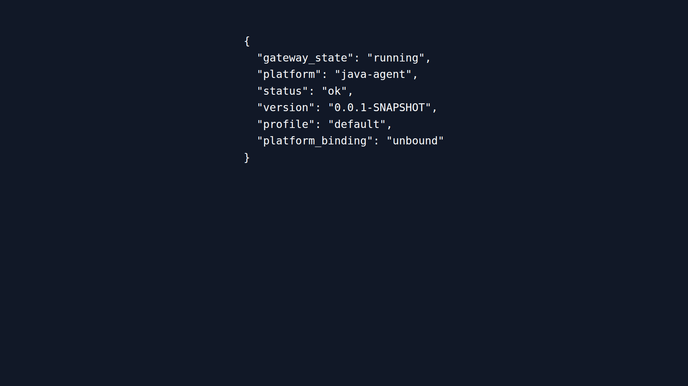
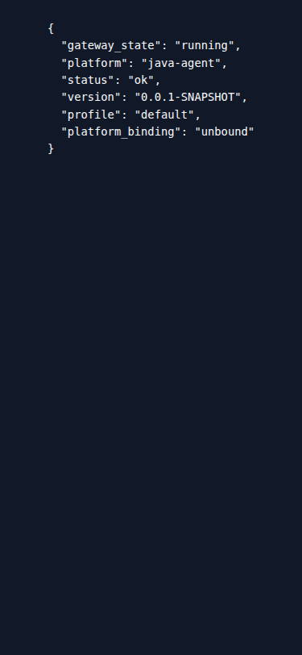
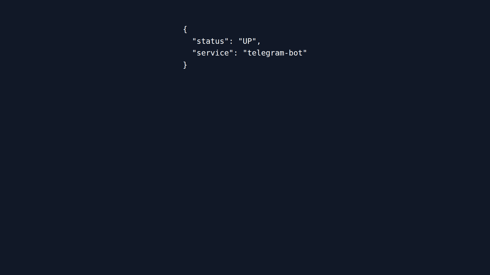

<p align="center">
  
</p>

<p align="center">
  <a href="#capabilities"></a>
  <a href="#runtime"></a>
  <a href="#interfaces"></a>
  <a href="#safety"></a>
  <a href="#quick-start"></a>
  <a href="#quality"></a>
</p>

<p align="center">
  
  
  
  
  
  
</p>

> **Java Agent** is a Spring Boot runtime for long-lived LLM work: REST/SSE and OpenAI-compatible APIs, a standalone CLI, managed tools, MCP connectivity, and a Telegram gateway. It is a source-available FerrPOINT product, not a hosted service or a generic browser dashboard.

## Runtime at a glance

| Boundary | Current behavior | Evidence in source/runtime |
|---|---|---|
| Agent API | Spring Boot REST/SSE runtime with a health surface and OpenAI-compatible endpoints. | `backend/`, `/health`, `/v1/*` |
| Conversation state | Sessions, context, checkpoints, compression, memory and approval workflows persist through the backend. | `backend/`, PostgreSQL/Flyway |
| Tool execution | File, terminal, web, browser, vision, skills, cron and delegation capability is policy-governed. | `backend/src/main/java/.../tools/` |
| Telegram | Separate gateway service exposes a narrow bot-health endpoint and delivers through the backend. | `telegram-bot/`, `/bot/health` |
| Operations | Actuator readiness/metrics run on a separate management port in the Base umbrella; it is not published as a public UI. | `MANAGEMENT_SERVER_PORT`, umbrella Compose |

<a name="capabilities"></a>

## Capabilities

| Area | What is implemented |
|---|---|
| Agent loop | Sync/SSE chat, session lifecycle, queues, steering, checkpoints, rollback/undo and context handling. |
| OpenAI compatibility | `/v1/chat/completions`, model discovery, capabilities, toolsets and response/run surfaces. |
| Tools | File/process, web, browser/CDP, vision, memory, skills, cron, delegation, TTS and gateway-facing tools. |
| MCP | Client/server integration, discovered tools/resources, configuration and OAuth flow support. |
| Interfaces | REST, SSE, OpenAI-compatible API, Picocli/JLine CLI REPL and the Telegram gateway. |
| Observability | Actuator health/readiness/metrics; readiness intentionally depends on the database rather than a live model or Chromium. |

The complete contract is intentionally larger than a README. See [the API/controller source](backend/src/main/java/com/azhukov/agent/api), [built-in tools](docs/09-builtin-tools.md), [the E2E coverage map](e2e/README.md), and [production notes](docs/10-production-readiness.md).

<a name="runtime"></a>

## Runtime Evidence

The Base umbrella exposes the agent API on `7761`, PostgreSQL privately on `7762`, and the Telegram gateway on `7763`. The management port is network-internal and is used for readiness and Prometheus scraping. These are local deployment coordinates, not a public hosted endpoint.

### API health: desktop



### API health: mobile 375x812



### Telegram gateway health



The evidence is captured from the running Base stack and intentionally contains only status, service/runtime identity, build shape and generic profile state. It does not prove Telegram API delivery or a model call; it proves the exposed local health surfaces respond successfully.

<a name="interfaces"></a>

## Interfaces

### API and CLI

| Surface | Purpose |
|---|---|
| `POST /api/v1/agent/chat` | Synchronous agent turn. |
| `POST /api/v1/agent/chat/stream` | SSE agent turn. |
| `POST /v1/chat/completions` | OpenAI-compatible chat completions. |
| `GET /v1/models` | Available model metadata. |
| `GET /v1/capabilities` | Machine-readable runtime capabilities. |
| `GET /v1/toolsets` | Toolset inventory. |
| `GET/POST /api/v2/sessions` | Session list/create. |
| `GET /health` | Safe runtime health summary. |

The CLI is an independent Spring Boot module that calls the backend through REST. It provides a REPL with slash commands, streaming output, autocomplete and markdown rendering; it does not share the backend process or its internal persistence objects.

### Authentication and tenancy

- API-key auth is enforced when configured. The global administrative key and per-user keys are distinct; only SHA-256 fingerprints of per-user keys are stored.
- User-scoped state covers sessions, memory, cron, checkpoints, usage and private skills.
- `GET /health` and the management health surface are deliberately low-detail operational endpoints. Authenticated endpoints, configuration, logs and tool execution are not public documentation evidence.

<a name="safety"></a>

## Safety Boundaries

| Boundary | Current contract |
|---|---|
| Secrets and PII | Output/log redaction is configurable; README examples never contain credentials, tokens, DSNs or real user data. |
| Risky tools | Destructive operations go through an approval gate; filesystem and URL tooling apply safety policy. |
| Network egress | SSRF and URL safety guards constrain network-capable tooling before use. |
| Browser | Chromium/CDP is local agent infrastructure. It is not a claim that arbitrary remote computer use is enabled. |
| Readiness | The health group tests database readiness; model, browser and MCP availability are separate operational concerns. |
| Telegram | `/bot/health` reports the bot service process state. It is not an end-to-end assertion about the external Telegram API. |

<a name="quick-start"></a>

## Quick Start

The checked-in Compose files are intentionally separate deployment profiles. Provide secrets through the ignored `.env` file or environment; do not place them in Compose or commands copied into documentation.

### Base umbrella runtime

From the Base workspace, start the already-defined stack and inspect only public health responses:

```bash
# From the parent Base workspace containing docker-compose.local.yml:
cd ..
docker compose -f docker-compose.local.yml up -d ja-db ja-agent ja-telegram-bot
curl -fsS http://127.0.0.1:7761/health
curl -fsS http://127.0.0.1:7763/bot/health
```

### Repository-local development fixture

```bash
cd java-agent
cp .env.example .env
# Set database, model and gateway values in .env outside version control.
docker compose -f docker-compose.local.yml up -d --build
curl -fsS http://127.0.0.1:18090/actuator/health/readiness
```

`docker-compose.dev.yml` is the source-isolated dev deployment; `scripts/deploy-dev-docker.sh` requires an existing database container and an operator-supplied `.env`. `docker-compose.e2e.yml` is an isolated test fixture, not a persistent environment.

<a name="quality"></a>

## Quality and Verification

| Gate | Command |
|---|---|
| README validator tests | `python3 -m unittest scripts.tests.test_verify_readme -v` |
| README structural validation | `python3 scripts/verify_readme.py` |
| Compose bot/backend auth wiring | `python3 scripts/check-compose-backend-auth.py` |
| Module tests | `./gradlew :backend:test :telegram-bot:test :cli:test --no-daemon` |
| Slow PostgreSQL integration | `./gradlew :backend:slowTest --no-daemon` |
| Docker Compose E2E | `./scripts/e2e-docker-compose-test.sh` |
| Release evidence report | `python3 scripts/release_verify.py` |

GitHub Actions runs the repository test, build-image and Markdown/YAML jobs. The README evidence job validates its own anchors, assets, placeholders, filesystem-path leakage and workflow badge references. It does not replace the Gradle, Docker or E2E gates.

## Project Map

```text
backend/        REST API, agent runtime, tools, MCP and persistence
telegram-bot/   Telegram delivery gateway
cli/            REST-connected interactive CLI
shared/         Shared REST DTOs and client helpers
e2e/            Declarative HTTP and CLI scenario suites
docs/           Architecture, parity, hardening and operational documentation
scripts/        Deterministic local verification helpers
```

## Documentation

- [AGENTS.md](AGENTS.md) - implementation conventions and detailed development facts.
- [docs/README.md](docs/README.md) - historical architecture and parity documentation index.
- [docs/09-builtin-tools.md](docs/09-builtin-tools.md) - tool inventory and boundaries.
- [docs/10-production-readiness.md](docs/10-production-readiness.md) - deployment, health and gateway notes.
- [e2e/README.md](e2e/README.md) - executed scenario map and evidence limitations.
- [LICENSE](LICENSE), [NOTICE](NOTICE), [THIRD_PARTY_NOTICES.md](THIRD_PARTY_NOTICES.md) - license and third-party notices.

## License

FerrPOINT Proprietary Source-Available Evaluation License v1.0. This is not open source. Viewing and evaluation are allowed under the repository license; commercial, production, resale, redistribution and SaaS/hosting use require a written FerrPOINT license.
