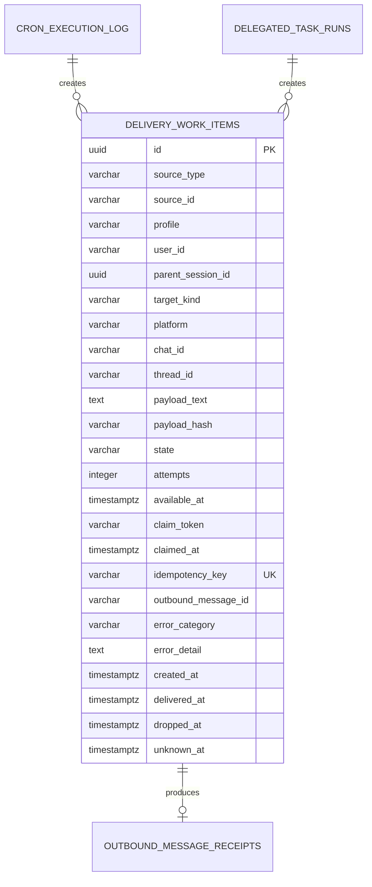

# ADR-011: One durable delivery-work ledger

- Status: Accepted
- Date: 2026-09-11
- Scope: cron final output, delegated-task final output and future gateway final delivery

## Context

Java agent currently has three incompatible delivery paths:

1. `CronJobService` records a run session and `CronDeliveryPoller` in the Telegram bot later scans jobs, reloads the last assistant message and advances `last_delivered_run_at`.
2. `DelegatedTaskRunService` stores claim and delivery fields on `delegated_task_runs`, then republishes completion events for a consumer that does not yet perform gateway reinjection.
3. `DeliveryRouter` parses targets and writes local files, but has no Spring wiring and is not the source of delivery truth.

The current cron high-water mark cannot identify a specific output, cannot atomically claim a delivery, and cannot distinguish "send did not start" from "platform received it but acknowledgement persistence failed". Delegate has a stronger per-run claim model, but it cannot be shared by cron, records no outbound receipt, and does not resolve a stored origin target.

Hermes reference `05d705dd` separates durable obligations from live transports:

- `gateway/delivery_ledger.py` records before send, marks attempting immediately before transport I/O, and fences recovery;
- `cron/delivery_queue.py` atomically claims queued cron output and terminalizes abandoned sends as an explicit unknown outcome instead of replaying an ambiguous send;
- platform delivery retains target profile/thread identity.

## Decision

Create a backend-owned `delivery_work_items` ledger. It is the sole durable source for every final cron and delegated-task delivery obligation. Existing source tables continue to own their business lifecycle:

- `cron_execution_log` owns cron execution state and output;
- `delegated_task_runs` owns child-run lifecycle and result;
- `delivery_work_items` owns delivery only.

A source completion and its delivery-work row are created in the same backend transaction. A delivery consumer claims work through a backend port/API, sends through one adapter, then reports exactly one terminal outcome. The initial Telegram bot remains an external process, so it consumes the backend ledger through a narrow authenticated API. Later in-process adapters use the same port; they do not get a second direct-to-table path.

`CronDeliveryPoller`, `DeliveryRouter`, cron `last_delivered_run_at`, and delegate-specific delivery columns are transitional compatibility code. They are removed only after their behavior has migrated and regression evidence proves no active caller relies on them.

## Logical model



The physical migration uses `source_type` plus text `source_id`, because a cron execution has an identity-generated numeric key while a delegated run has a UUID. Application code validates the type/source pair; the database enforces idempotency and delivery state constraints. A target is stored in normalized columns so ownership and thread queries can be indexed and validated without JSON parsing.

### Source and target invariants

1. `source_type` is initially `cron_execution` or `delegated_task_run`; `source_id` identifies exactly one completed source row.
2. A unique `(source_type, source_id, target_hash)` prevents duplicate obligations for a source/target pair. `target_hash` is computed from normalized profile, kind, platform, chat and thread fields.
3. `origin` is resolved and persisted at enqueue time from the source session. It is never resolved from a current bot owner or current default profile at delivery time.
4. `local` is terminal without platform send and records its controlled output artifact/receipt.
5. `platform:chat_id` and `platform:chat_id:thread_id` are normalized before persistence. Unknown/malformed target fails before an obligation is created.
6. Payload and receipt are different values. Payload may later become an artifact reference, but the first migration stores bounded final text plus SHA-256 hash.
7. `[SILENT]` is terminally acknowledged without a transport send; it must still produce an auditable work item or explicit terminal source record.

### State machine

```text
pending -> claimed -> delivered
pending -> claimed -> pending       (known pre-send failure, retry scheduled)
pending -> claimed -> dropped       (attempt cap or non-retryable failure)
pending -> claimed -> unknown       (consumer died or send outcome is ambiguous)
pending -> local_delivered
```

- Claim uses conditional update by `id`, `state`, `available_at`, and stale claim boundary. It increments `attempts` exactly once per real send attempt.
- `delivered`, `dropped`, `unknown`, and `local_delivered` are terminal and idempotent.
- A process crash after transport I/O but before acknowledgement is `unknown`, not automatically retried. The user-visible recovery policy may later offer an explicit marked redelivery; it never silently duplicates the response.
- A partial multi-chunk platform send is `unknown` unless every chunk receipt was persisted. It must not acknowledge the whole item after only one chunk.
- Retryable known failures set `available_at` with bounded exponential delay; they do not spin in the poller.

## Consumer contract

The backend exposes one internal delivery port with operations equivalent to:

1. `claimNext(consumerId, supportedTargets, now)` returns one immutable work item and claim token.
2. `markDelivered(id, claimToken, receipt)` records platform, target, outbound message id(s) and terminal timestamp.
3. `releaseKnownFailure(id, claimToken, category, redactedDetail, retryAt)` returns work to `pending` only when no transport send occurred.
4. `markUnknown(id, claimToken, category, redactedDetail)` fences ambiguous delivery.
5. `drop(id, claimToken, category, redactedDetail)` terminalizes non-retryable/expired work.

`DeliveryReceipt` is immutable and includes platform, normalized target, outbound message IDs, chunk count and a transport timestamp. Error details are redacted before persistence and API output.

## Migration plan

1. Add `delivery_work_items` and `outbound_message_receipts`, indexes on `(state, available_at)`, `(profile, state, available_at)`, `(parent_session_id, state)`, and the unique source/target key.
2. Add a source transaction helper. It persists cron output before enqueueing; no-agent cron output must no longer be only a log line. Delegate completion creates one obligation whose source is the completed run.
3. Add repository conditional-claim methods and Postgres/Testcontainers tests before wiring a consumer.
4. Add internal backend controller/DTOs for the separately deployed Telegram bot. Authentication identifies consumer and profile; callers cannot claim another profile's work.
5. Port Telegram polling to claim/ack the shared ledger, including chunk receipt handling and known-vs-unknown errors.
6. Add parent-session reinjection on terminal delegated delivery with a durable unique marker keyed by delegated run and parent session.
7. Delete the cron high-water delivery flow and delegate-specific delivery state after migration parity tests are green. Do not run both consumers for the same source.

## Consequences

### Positive

- Cron and delegate use one retry, receipt, idempotency and restart contract.
- Future platform adapters do not duplicate delivery persistence.
- Dashboard/gateway work can query real delivery state instead of inferring it from a session message or timestamp.
- Structured targets prepare topic/thread delivery without a string parser at each send site.

### Costs and risks

- This adds one table, a source transaction boundary and an internal consumer API before user-visible gateway enhancements.
- Migration must not reserve a version early. Immediately before implementation, scan both `db/migration` and `db/postgresql` and select the next globally unique Flyway version.
- The Telegram bot and backend are independent processes. No in-memory queue, Spring event, or static singleton can be treated as durable cross-process delivery.
- Existing delegate columns cannot be removed until all API/tool read paths are migrated and Testcontainers recovery tests prove equivalence.

## Verification

Required before declaring the decision implemented:

1. Unit: target normalization, error category selection, state transitions, idempotent terminal calls, silence/local handling and redaction.
2. PostgreSQL/Testcontainers: two consumers racing one claim, stale claim fencing, restart after claim, unique source/target row, transaction rollback and profile/user isolation.
3. Backend integration: cron success/failure/no-change and delegate completion create the correct source plus delivery row in one transaction.
4. Telegram fixture: exact chat/thread API payload, ordered chunks, all receipts persisted, known failure retry and ambiguous send terminalized as unknown.
5. Delegate E2E: one terminal result causes one parent-session reinjection and one outbound delivery; repeat poll or restart cannot duplicate either.
6. Cleanup: terminal retention/expiry removes payload and receipt artifacts on schedule without deleting source audit history.
