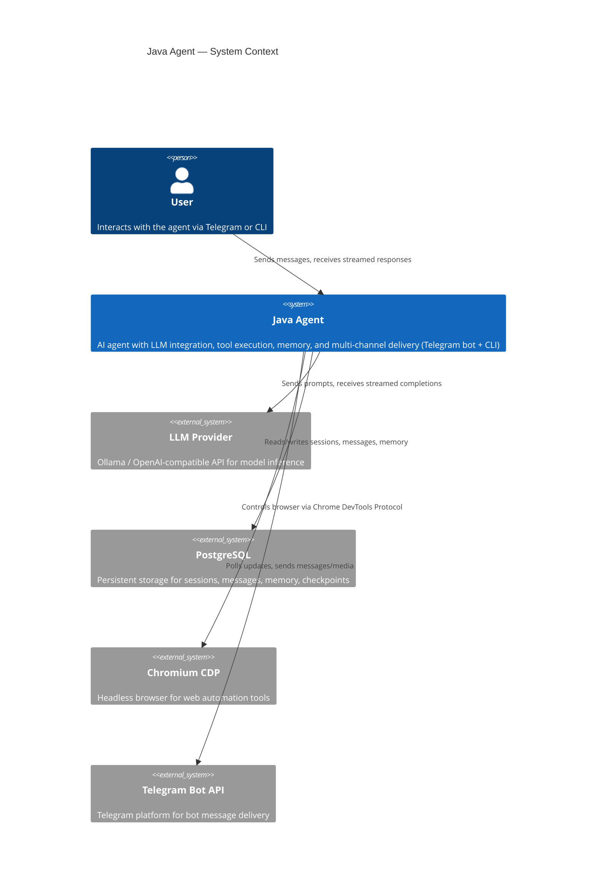
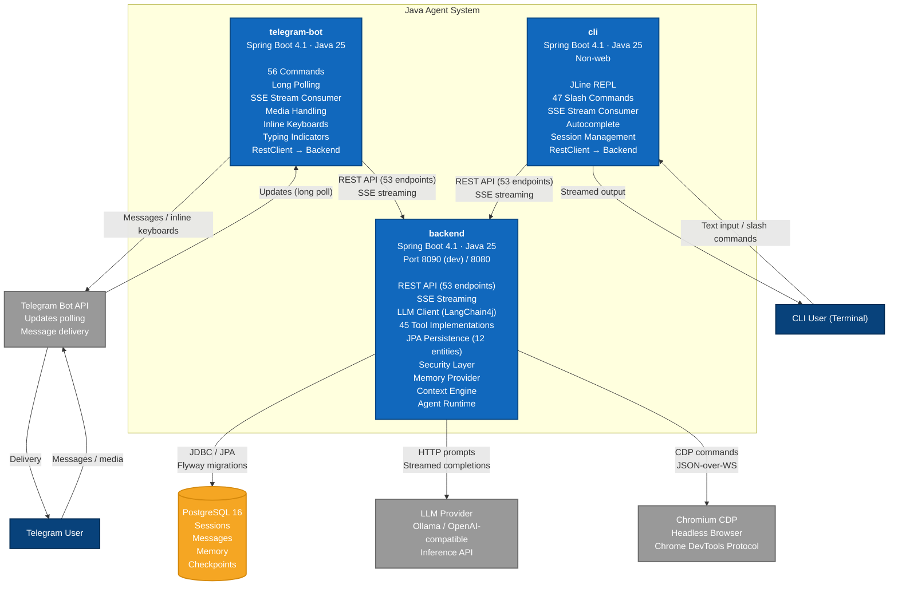
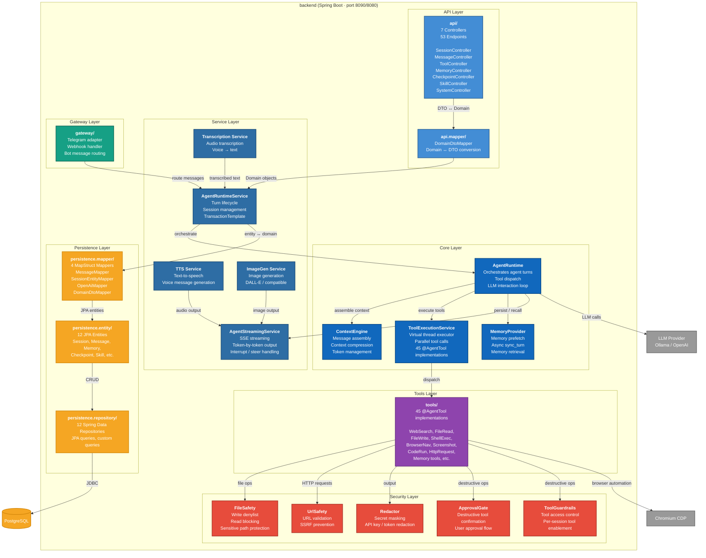

# C4 Model — Java Agent Architecture

This document describes the Java Agent system using the C4 model (Context, Container, Component) with Mermaid diagrams renderable in GitLab/GitHub markdown.

---

## Level 1: System Context

The System Context diagram shows the Java Agent as a whole, its users, and the external systems it interacts with.

### Description

| Element | Description |
|---------|-------------|
| **User** | A human who interacts with the agent through Telegram (bot) or a local terminal (CLI). |
| **Java Agent** | The complete system — a Spring Boot application suite providing AI agent capabilities: LLM orchestration, tool execution (45 tools), persistent memory, session management, and multi-channel delivery. |
| **LLM Provider** | External model inference API. Supports Ollama (local/cloud) and OpenAI-compatible endpoints. Used for generating responses, context compression, and tool-call decisions. |
| **PostgreSQL** | Primary datastore. Stores sessions, messages, memory entries, checkpoints, and agent metadata. Flyway manages migrations. |
| **Chromium CDP** | Headless Chromium browser controlled via Chrome DevTools Protocol. Used by browser automation tools (navigation, scraping, screenshots). |
| **Telegram Bot API** | Telegram's platform API. The bot polls for updates and sends messages, media, and inline keyboards back to users. |

---

## Level 2: Container

The Container diagram shows the deployable units within the Java Agent system and how they communicate.

### Container Descriptions

| Container | Technology | Responsibility |
|----------|------------|----------------|
| **backend** | Spring Boot 4.1, Java 25, port 8090/8080 | Core agent engine. REST API (7 controllers, 53 endpoints). SSE streaming. LLM client (LangChain4j 1.18). 45 `@AgentTool` implementations. JPA persistence (12 entities, 12 repositories, 4 MapStruct mappers). Security layer (FileSafety, Redactor, UrlSafety, ToolGuardrails, ApprovalGate). Memory provider. Context engine. Agent runtime. |
| **telegram-bot** | Spring Boot 4.1, Java 25 | Telegram delivery channel. 56 commands. Long polling for updates. SSE stream consumer (real-time token output). Media handling (photos, voice, documents). Inline keyboards, typing indicators. Communicates with backend exclusively via REST. |
| **cli** | Spring Boot 4.1, Java 25, non-web | Local terminal interface. JLine REPL with autocomplete. 47 slash commands (`/new`, `/status`, `/compress`, `/undo`, `/checkpoint`, `/rollback`, `/memory`, `/skills`, `/help`, `/exit`). SSE stream consumer. Session management. Communicates with backend exclusively via REST. |

### External Systems

| System | Protocol | Purpose |
|--------|----------|---------|
| **PostgreSQL 16** | JDBC (port 5432) | Primary datastore. Flyway manages schema migrations. |
| **LLM Provider** | HTTP (Ollama / OpenAI-compatible) | Model inference. Streamed completions via SSE. Retries with jittered backoff. |
| **Chromium CDP** | WebSocket (Chrome DevTools Protocol) | Headless browser automation. Page navigation, DOM interaction, screenshots. |
| **Telegram Bot API** | HTTPS (long polling) | Message delivery and update polling. No webhook required. |

### Communication Patterns

- **Bot ↔ Backend**: REST over HTTP. Bot calls backend's 53 endpoints. SSE for streaming responses. Bot is a pure HTTP client — no shared code with backend.
- **CLI ↔ Backend**: REST over HTTP. Identical API usage as bot. SSE for streaming. CLI is a standalone JAR (`java -jar`).
- **Backend ↔ LLM**: HTTP with SSE streaming. LangChain4j client. Retry with jittered exponential backoff. Supports Ollama and OpenAI-compatible providers.
- **Backend ↔ PostgreSQL**: JDBC via Spring Data JPA / Hibernate. Flyway migrations. H2 in PostgreSQL mode for tests.
- **Backend ↔ Chromium**: WebSocket CDP. `SsrfSafeHttpClient` ensures only approved CDP endpoints are used.

---

## Level 3: Component (Backend)

The Component diagram shows the internal structure of the `backend` container.

### Component Descriptions

#### API Layer (`api/`)

| Component | Description |
|-----------|-------------|
| **Controllers (7)** | `SessionController`, `MessageController`, `ToolController`, `MemoryController`, `CheckpointController`, `SkillController`, `SystemController`. Expose 53 REST endpoints. Return DTOs (records), never entities. |
| **`api.mapper/`** | `DomainDtoMapper` converts domain models to/from DTOs using MapStruct (`unmappedTargetPolicy = ERROR`). |

#### Core Layer (`core/`)

| Component | Description |
|-------------|-------------|
| **`AgentRuntime`** | The agent loop: receives user message → assembles context → calls LLM → dispatches tool calls → streams response → persists. Orchestrates the entire turn lifecycle. |
| **`ContextEngine`** | Assembles the prompt: system instructions + memory + conversation history + tool definitions. Manages context window limits. Performs context compression (with anti-injection prefix) when token limits are approached. |
| **`MemoryProvider`** | Manages long-term memory. Prefetches relevant memories before a turn (reduces latency). Persists new memories asynchronously via `sync_turn` on a background daemon thread. |
| **`ToolExecutionService`** | Executes `@AgentTool`-annotated methods in parallel using `Executors.newVirtualThreadPerTaskExecutor()`. Handles tool result aggregation, timeouts, and error isolation. |

#### Service Layer (`service/`)

| Component | Description |
|-------------|-------------|
| **`AgentRuntimeService`** | Turn lifecycle management. Session state transitions. Uses `TransactionTemplate` for programmatic transactions in streaming contexts (avoids `@Transactional` self-invocation pitfall). |
| **`AgentStreamingService`** | SSE token streaming. Manages `SseEmitter` lifecycle. Handles interrupts (user cancellation) and steer (mid-turn message injection) via `ConcurrentHashMap`-backed session state. |
| **TTS Service** | Text-to-speech generation. Produces audio for voice messages (Telegram). |
| **ImageGen Service** | Image generation via DALL-E or compatible API. |
| **Transcription Service** | Audio transcription (voice → text). Feeds transcribed text into the agent runtime. |

#### Persistence Layer (`persistence/`)

| Component | Description |
|-------------|-------------|
| **Entities (12)** | `Session`, `Message`, `Memory`, `Checkpoint`, `Skill`, and 7 others. JPA entities annotated with `@Entity` + Lombok `@Data`. |
| **Repositories (12)** | Spring Data JPA repositories. Custom queries where needed. |
| **Mappers (4)** | `MessageMapper` (MessageEntity ↔ Message), `SessionEntityMapper` (SessionEntity ↔ Session), `OpenAiMapper` (Domain ↔ OpenAI DTOs), `DomainDtoMapper` (Session → SessionSummaryDto). MapStruct-generated, Spring-managed, `unmappedTargetPolicy = ERROR`. |

#### Tools Layer (`tools/`)

| Component | Description |
|-------------|-------------|
| **45 `@AgentTool` implementations** | Web search, file read/write, shell execution, browser navigation, screenshots, code execution, HTTP requests, memory tools, and more. Each annotated with `@AgentTool`, discovered at startup, and registered with `ToolExecutionService`. |

#### Gateway Layer (`gateway/`)

| Component | Description |
|-------------|-------------|
| **Telegram adapter** | Routes incoming Telegram updates to the appropriate agent service. Handles media (photos, voice, documents). Manages bot-specific formatting (Markdown → Telegram HTML). |
| **Webhook handler** | Optional webhook endpoint (long polling is the default). |

#### Security Layer (`security/`)

| Component | Description |
|-------------|-------------|
| **`FileSafety`** | Write denylist: blocks writes to sensitive paths (`/etc/`, `~/.ssh/`, `.env`). Read blocking: prevents reading secrets/credentials. |
| **`Redactor`** | Masks API keys, tokens, and secrets in tool output before sending to the LLM. |
| **`UrlSafety`** | Validates URLs to prevent SSRF. Blocks private/local IP ranges. Used by `SsrfSafeHttpClient`. |
| **`ToolGuardrails`** | Per-session tool enablement. Controls which tools are available in a given context. |
| **`ApprovalGate`** | Destructive tools (file delete, shell command) require explicit user confirmation before execution. |