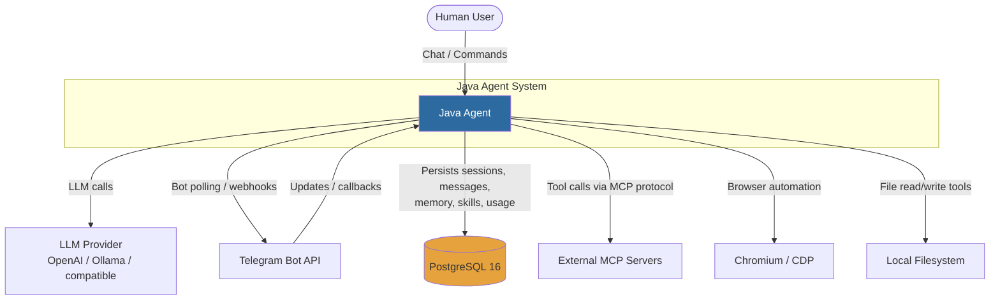
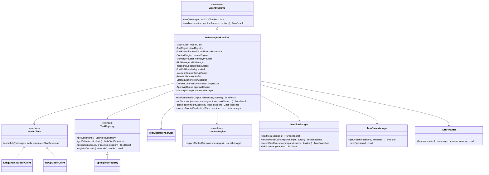
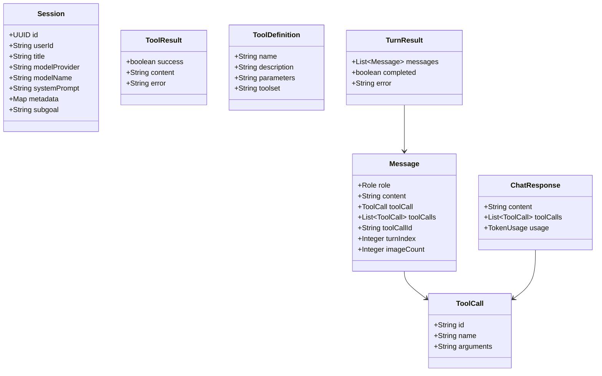

# C4 Model — Java Agent

> Architecture described using the [C4 model](https://c4model.com/).
> All diagrams are Mermaid — render inline in GitLab/GitHub.

---

## Level 1 — System Context

The Java Agent is an autonomous LLM-powered assistant accessible via REST API,
Telegram bot, and interactive CLI. It integrates with LLM providers (OpenAI-compatible),
external tools (filesystem, browser, terminal), and MCP servers.



### External Dependencies

| Dependency | Protocol | Purpose |
|------------|----------|---------|
| LLM Provider | HTTP (OpenAI-compatible API) | Chat completions, streaming, tool-calling |
| Telegram Bot API | HTTPS long-polling / webhook | Bot message delivery |
| PostgreSQL 16 | TCP (JDBC) | Persistence: sessions, messages, memory, skills, usage, cron jobs |
| External MCP Servers | stdio / SSE | External tool integration |
| Chromium | CDP (WebSocket) | Browser automation tool |

---

## Level 2 — Containers

Three independently deployable Gradle modules sharing a PostgreSQL database.

```mermaid
graph TB
    subgraph "Java Agent System"
        BE[Backend<br/>Spring Boot 4.1<br/>REST API + Agent Runtime<br/>Port 8090]
        BOT[Telegram Bot<br/>Spring Boot app<br/>56 commands + streaming<br/>Shared PostgreSQL]
        CLI[CLI<br/>Spring Boot (non-web)<br/>JLine REPL<br/>74 slash commands]
    end

    PG[(PostgreSQL 16<br/>Shared database)]
    LLM[LLM Provider]
    TG[Telegram Bot API]

    User -->|REST / SSE| CLI
    User -->|Telegram| TG
    TG -->|Updates| BOT
    User -->|REST / SSE| BE

    CLI -->|REST + SSE streaming| BE
    BOT -->|REST + SSE streaming| BE
    BE -->|LLM calls| LLM
    BE -->|JPA / Flyway| PG
    BOT -->|JPA (bot schema)| PG

    style BE fill:#2d6a9f,color:#fff
    style BOT fill:#67c23a,color:#fff
    style CLI fill:#e6a23c,color:#fff
    style PG fill:#f56c6c,color:#fff
```

### Container Descriptions

| Container | Type | Tech | Description |
|-----------|------|------|-------------|
| **Backend** | Spring Boot web app | Java 25, Spring Boot 4.1, LangChain4j 1.18, MCP SDK 2.0 | Core agent runtime: LLM orchestration, tool execution, context management, memory, skills, compression, streaming, 86 REST endpoints |
| **Telegram Bot** | Spring Boot app | Java 25, Spring Boot 4.1, Telegram API | 56 commands, long-polling + webhook, SSE streaming from backend, media handling, session management, shared PostgreSQL |
| **CLI** | Spring Boot (non-web) | Java 25, Spring Boot 4.1, JLine 3 | Interactive REPL with 74 slash commands, SSE streaming from backend, JLine autocomplete, ANSI markdown rendering |

---

## Level 3 — Components (Backend)

The backend module broken into its internal component packages.

```mermaid
graph TB
    subgraph "Backend Module"
        API[api/<br/>Controllers + DTOs<br/>86 REST endpoints]
        SVC[service/<br/>RuntimeService,<br/>StreamingService,<br/>CheckpointManager,<br/>UsageTracker, CronService]
        CORE[core/<br/>AgentRuntime, ToolRegistry,<br/>ContextEngine, Memory,<br/>Skills, State, Budget]
        CLIENT[client/<br/>LangChain4j client,<br/>NoOp client, MCP client]
        TOOLS[tools/<br/>@AgentTool implementations<br/>web, file, browser,<br/>terminal, coding, etc.]
        PERSIST[persistence/<br/>JPA entities, repositories,<br/>MapStruct mappers, Flyway]
        CONFIG[config/<br/>AgentProperties,<br/>MapStructConfig, beans]
        SEC[security/<br/>SSRF guard, file/URL safety,<br/>redactor, sanitizers]
        GW[gateway/<br/>Telegram webhook adapter,<br/>routing]
    end

    API -->|MapStruct DTO mappers| SVC
    SVC -->|domain calls| CORE
    CORE -->|ModelClient interface| CLIENT
    CORE -->|ToolRegistry interface| TOOLS
    SVC -->|entity ↔ domain mappers| PERSIST
    CORE -->|entity ↔ domain mappers| PERSIST
    TOOLS -->|security checks| SEC
    GW -->|delegates to| SVC
    CONFIG -.->|injects properties| API
    CONFIG -.->|injects properties| CORE
    CONFIG -.->|injects properties| TOOLS

    style API fill:#2d6a9f,color:#fff
    style SVC fill:#67c23a,color:#fff
    style CORE fill:#e6a23c,color:#fff
    style CLIENT fill:#f56c6c,color:#fff
    style TOOLS fill:#909399,color:#fff
    style PERSIST fill:#a06535,color:#fff
```

### Component Responsibilities

| Package | Responsibility |
|----------|---------------|
| `api/` | REST controllers (`AgentController`, `McpController`), request/response DTOs, `DomainDtoMapper`, `OpenAiMapper` |
| `service/` | `AgentRuntimeService` (orchestrates turns), `AgentStreamingService` (SSE), `CheckpointManager`, `UsageTracker`, `CronJobService`, `ConversationCompressor`, TTS/transcription providers |
| `core/` | `AgentRuntime` (turn loop), `ToolRegistry`, `ToolExecutionService`, `ContextEngine`, `ContextCompressor`, `MemoryProvider`/`MemoryManager`, `SkillManager`, `CuratorService`, `TurnStateManager`, `IterationBudget`, `PromptBuilder` |
| `client/` | `LangChain4jModelClient`, `NoOpModelClient`, MCP lifecycle/OAuth, auxiliary model backend, `ErrorClassifier`, `RateLimitTracker` |
| `tools/` | `@AgentTool` implementations: web search, file ops, browser, terminal, coding, image gen, delegation, memory, etc. |
| `persistence/` | 14 JPA entities, Spring Data repositories, 4 MapStruct mappers, Flyway migrations V1–V18 |
| `config/` | `AgentProperties` (@ConfigurationProperties), `MapStructConfig`, Spring bean definitions |
| `security/` | `SsrfSafeHttpClient`, `DefaultFileSafety`, `DefaultUrlSafety`, `DefaultRedactor`, `MessageSanitizer`, `UserInputSanitizer`, `ToolCallGuardrail` |
| `gateway/` | Telegram webhook adapter, routing metadata |

---

## Level 4 — Code (Key Classes)

The agent runtime loop — the core of the system.



### Domain Model (records)

