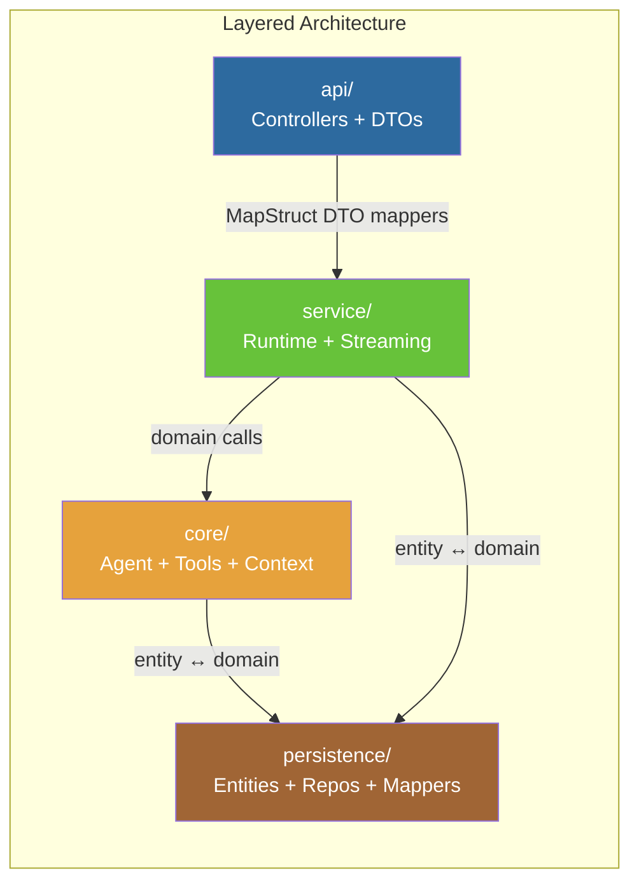

# Component Diagram

> Module-level dependencies across the three Gradle modules.
> Mermaid renders inline in GitLab/GitHub.

---

## Module Overview

```mermaid
graph TB
    subgraph "Gradle Multi-Project"
        subgraph backend["backend module"]
            AC[AgentController<br/>McpController<br/>132 REST endpoints]
            ARS[AgentRuntimeService<br/>AgentStreamingService]
            DAR[DefaultAgentRuntime<br/>Turn loop, retry, tool dispatch]
            TE[ToolExecutionService<br/>Virtual thread executor]
            TR[SpringToolRegistry<br/>Tool discovery]
            CE[ContextEngine<br/>ContextCompressor]
            MM[MemoryProvider<br/>MemoryManager<br/>BackgroundReviewService]
            SM[SkillManager<br/>CuratorService]
            MC[ModelClient<br/>LangChain4j / NoOp]
            MCP[MCP Client<br/>Lifecycle / OAuth]
            SEC[Security<br/>SSRF, FileSafety,<br/>Redactor, Guardrail]
            PERS[JPA Entities<br/>Repositories<br/>4 MapStruct mappers]
            FW[Flyway<br/>V1–V18]
            CP[CheckpointManager]
            CR[CronJobService]
            UT[UsageTracker]
        end

        subgraph telegram-bot["telegram-bot module"]
            BMP[BotMessageProcessor<br/>Central dispatcher]
            CR2[CommandRegistry<br/>56 commands + 10 aliases]
            LP[LongPollingService<br/>ReconnectWatcher]
            SE[StreamEditor<br/>Edit-message streaming]
            ABC[AgentBackendClient<br/>REST + SSE to backend]
            TYP[TypingManager]
            MED[MediaCache<br/>InboundMediaHandler]
            BSS[BotSessionStore]
            GAC[GoalAutoContinueService]
            AUTH[AuthorizationService]
            TGC[TelegramClient]
        end

        subgraph cli["cli module"]
            REPL[ReplLoop<br/>JLine interactive]
            SCR[SlashCommandRegistry<br/>92 commands]
            BC[BackendClient<br/>REST + SSE to backend]
            MD[MarkdownRenderer<br/>ANSI]
            SC[SlashCompleter<br/>SlashAutoSuggest]
        end
    end

    DB[(PostgreSQL 16)]
    LLM[LLM Provider]
    TG[Telegram Bot API]

    AC --> ARS
    ARS --> DAR
    ARS --> CP
    ARS --> CR
    ARS --> UT
    DAR --> MC
    DAR --> TR
    DAR --> TE
    DAR --> CE
    DAR --> MM
    DAR --> SM
    DAR --> SEC
    TR --> TE
    MC --> MCP
    PERS --> FW
    ARS --> PERS

    BMP --> CR2
    BMP --> ABC
    BMP --> SE
    BMP --> TYP
    BMP --> MED
    BMP --> BSS
    BMP --> GAC
    BMP --> AUTH
    LP --> TGC
    ABC -->|REST + SSE| AC

    REPL --> SCR
    REPL --> BC
    REPL --> MD
    SCR --> SC
    BC -->|REST + SSE| AC

    MC -->|HTTP| LLM
    TGC -->|HTTPS| TG

    PERS -->|JDBC| DB
    BSS -->|JDBC| DB

    style backend fill:#e8f4f8,stroke:#2d6a9f
    style telegram-bot fill:#e8f7e8,stroke:#67c23a
    style cli fill:#fff8e8,stroke:#e6a23c
    style DB fill:#f56c6c,color:#fff
```

---

## Backend Internal Dependencies

### Layering Rules

1. **Controllers** never touch JPA entities directly — MapStruct mappers convert between domain ↔ DTO.
2. **Domain models** (`core.model`) are Java `record`s, not JPA entities.
3. **Bot layer** is an exception: entities are used as domain models (no separate mapping layer).
4. **MapStruct** config: `componentModel = "spring"`, `unmappedTargetPolicy = ERROR` — ensures no silent mapping gaps.
