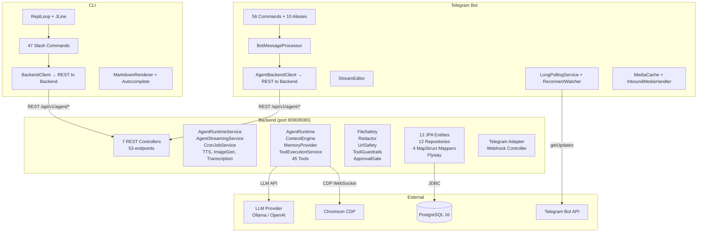

# Component Diagram

> **Project:** java-agent · **Java** 25 · **Spring Boot** 4.1
> **Modules:** `backend`, `telegram-bot`, `cli` (Gradle multi-project)

This document shows the three modules of the java-agent system, their internal components,
inter-module dependencies, and connections to external systems.

---

## Diagram

---

## Module Dependency Table

| Module | Depends on | Communication |
|--------|------------|---------------|
| **backend** | PostgreSQL, LLM API, Chromium CDP, Telegram Bot API (webhook mode) | REST + JDBC + WebSocket (CDP) |
| **telegram-bot** | backend (REST), Telegram Bot API | HTTP REST (long-polling or webhook) |
| **cli** | backend (REST) | HTTP REST |

---

## Internal Component Breakdown

### Backend (`/opt/dev/java-agent/backend`)

| Component | Key classes | Role |
|----------|------------|------|
| **Controllers** | `AgentController`, `ChatCompletionsController`, `CronJobController`, `VisionController`, `HealthController`, `McpController`, `GlobalExceptionHandler` | 7 REST controllers exposing 53 endpoints; handle request validation, SSE streaming, error mapping |
| **Services** | `AgentRuntimeService`, `AgentStreamingService`, `CronJobService`, `TtsService`, `ImageGenProvider`, `TranscriptionService` | Application-service layer; orchestrate agent turns, streaming, cron jobs, TTS/image-gen/transcription |
| **Core** | `DefaultAgentRuntime`, `DefaultContextEngine`, `DatabaseMemoryProvider`, `ToolExecutionService`, 45 `ToolHandler` implementations | Domain core: agent loop, context management, memory, tool execution (virtual-thread parallel) |
| **Security** | `DefaultFileSafety`, `DefaultRedactor`, `DefaultUrlSafety`, `DefaultToolGuardrails`, `ApprovalGate`, `SsrfSafeHttpClient` | Guardrails, secret redaction, SSRF protection, file/URL validation, approval workflow |
| **Persistence** | 12 JPA entities, 12 Spring Data repositories, 4 MapStruct mappers (`MessageMapper`, `SessionEntityMapper`, `DomainDtoMapper`, `OpenAiMapper`), Flyway migrations | Database layer; entities ↔ domain mapping, schema migration |
| **Gateway** | `TelegramAdapter`, `TelegramWebhookController`, `TelegramBotApiClient`, `TelegramLongPollingService` | Telegram platform adapter; webhook + long-polling modes |

### Telegram Bot (`/opt/dev/java-agent/telegram-bot`)

| Component | Key classes | Role |
|----------|------------|------|
| **Bot Commands** | `CommandRegistry`, 56 `CommandHandler` implementations (e.g. `StartCommand`, `StatusCommand`, `MemoryCommand`, `CompressCommand`, …) + 10 aliases | Slash-command handlers for Telegram chats |
| **BotMessageProcessor** | `BotMessageProcessor`, `AgentBackendClient` | Core message-processing pipeline; forwards user text to backend via REST, streams responses back |
| **Streaming** | `StreamEditor` | Edits streamed messages in-place (Telegram message updates) |
| **Polling** | `LongPollingService`, `ReconnectWatcher` | Telegram getUpdates long-polling with auto-reconnect |
| **Media** | `MediaCache`, `InboundMediaHandler`, `MediaDownloader` | Caches and downloads inbound media (photos, voice, documents) |

### CLI (`/opt/dev/java-agent/cli`)

| Component | Key classes | Role |
|----------|------------|------|
| **ReplLoop** | `ReplLoop`, `CliReplRunner` (JLine `LineReader`) | Interactive REPL; dispatches `/`-prefixed lines to `SlashCommandRegistry`, plain text to `BackendClient.chatStream()` |
| **Slash Commands** | `SlashCommandRegistry`, 47 `SlashCommand` entries | Command processing (`/new`, `/status`, `/compress`, `/undo`, `/checkpoint`, `/rollback`, `/memory`, `/skills`, `/help`, `/exit`, etc.) |
| **BackendClient** | `BackendClient`, `BackendProperties` | REST client to backend; SSE streaming for real-time token output |
| **MarkdownRenderer** | `MarkdownRenderer`, `SlashAutoSuggest`, `SlashCompleter` | Terminal markdown rendering and slash-command autocomplete |

---

## External System Dependencies

| External system | Protocol | Used by | Purpose |
|----------------|----------|---------|---------|
| **LLM Provider** (Ollama / OpenAI-compatible) | HTTP REST (SSE) | `backend` → `ModelClient` → `LangChain4jModelClient` | Chat completions, streaming, tool-calling |
| **PostgreSQL 16** | JDBC | `backend` → persistence layer | Session, message, memory, skill, cron-job, audit-log storage; Flyway migrations |
| **Chromium** (headless) | CDP WebSocket | `backend` → `BrowserService` → `CdpClient` | Browser automation tools (navigate, click, type, snapshot, scroll, vision) |
| **Telegram Bot API** | HTTP REST (long-polling or webhook) | `telegram-bot` → `LongPollingService` / `WebhookController`; `backend` → `TelegramBotApiClient` (webhook mode) | Send/receive messages, media, inline keyboards, reactions |