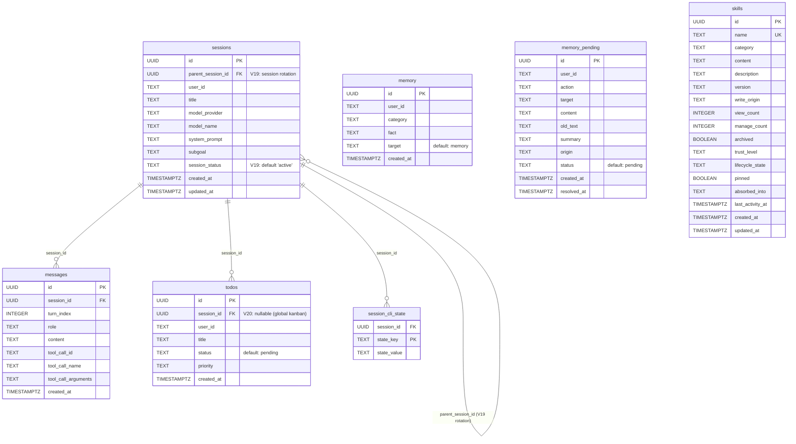
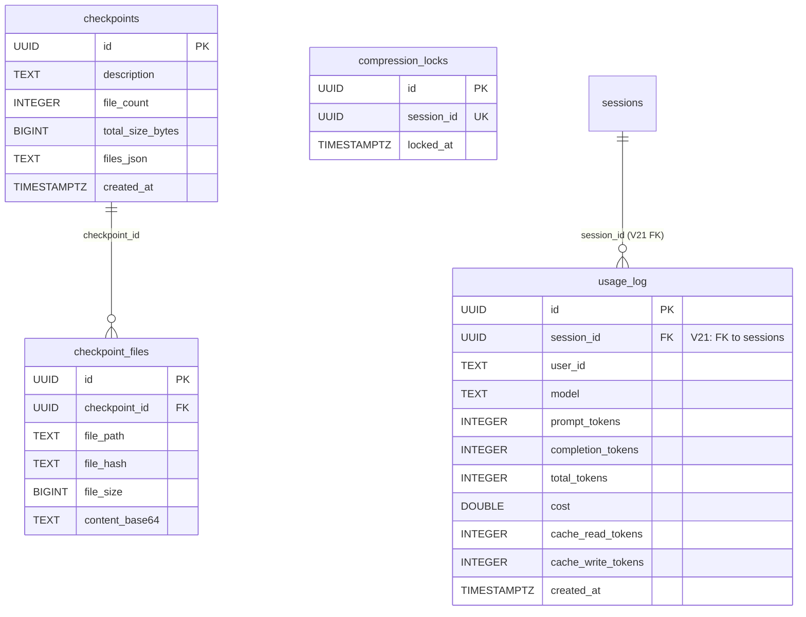
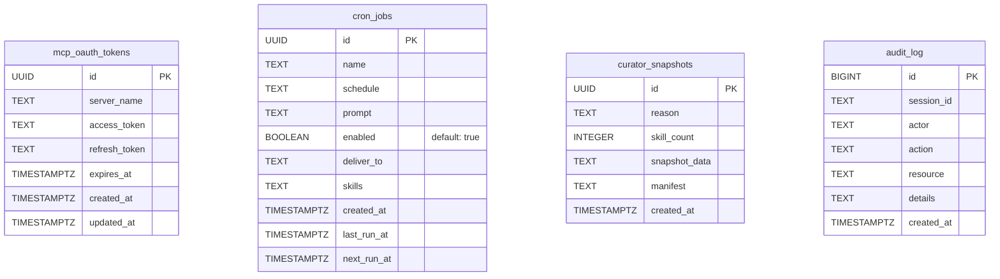

# Entity-Relationship Diagram

> Derived from JPA entities (`persistence/entity/`) and Flyway migrations (V1–V26).
> Mermaid ER diagram syntax.

---

## Core Schema

---

## Checkpoint & Usage

---

## MCP, Cron & Curator

---

## Migration History

| Migration | Description |
|-----------|-------------|
| V1 | Baseline (placeholder) |
| V2 | Agent schema: sessions, messages, memory, todos, skills, context_references, compression_locks, approvals, gateway_routing, session_model_usage |
| V3 | Todos: add title, priority columns |
| V4 | Todos: drop content column |
| V5 | Memory: add target column |
| V6 | Memory: pending memory table |
| V7 | Cron jobs table |
| V8 | Checkpoints table |
| V9 | Usage log table |
| V10 | MCP OAuth tokens |
| V11 | Audit log |
| V12 | Skill provenance & telemetry (write_origin, view_count, manage_count, last_activity_at) |
| V13 | Curator snapshots |
| V14 | Cron jobs: add skills column |
| V15 | Curator lifecycle fields (lifecycle_state, pinned, absorbed_into) |
| V16 | Session CLI state (ElementCollection → session_cli_state table) |
| V17 | Checkpoint files table |
| V18 | Session search FTS |
| V19 | Session rotation (parent_session_id, session_status) |
| V20 | Todos: nullable session_id for global kanban items |
| V21 | FK constraints (sessions.parent_session_id, usage_log.session_id) |
| V22 | Composite indexes (todos, messages, usage_log, memory_pending, skills, cron_jobs, bot_sessions) |
| V23 | Dead table cleanup (dropped: gateway_routing, context_references, approvals, session_model_usage) |
| V24 | Memory version (version column on memory table) |
| V25 | Cron context_from (context_from column on cron_jobs) |
| V26 | Cron full fields (additional cron job metadata columns) |

---

## Entity Count

| Entity | Table | Migrations |
|--------|-------|------------|
| `SessionEntity` | `sessions` | V2, V16, V19 |
| `MessageEntity` | `messages` | V2 |
| `MemoryEntity` | `memory` | V2, V5 |
| `PendingMemoryEntity` | `memory_pending` | V6 |
| `TodoEntity` | `todos` | V2, V3, V4, V20 |
| `SkillEntity` | `skills` | V2, V12, V15 |
| `CheckpointEntity` | `checkpoints` | V8, V17 |
| `CheckpointFileEntity` | `checkpoint_files` | V17 |
| `UsageEntity` | `usage_log` | V9, V21 |
| `CronJobEntity` | `cron_jobs` | V7, V14 |
| `McpOAuthEntity` | `mcp_oauth_tokens` | V10 |
| `AuditLogEntity` | `audit_log` | V11 |
| `CuratorSnapshotEntity` | `curator_snapshots` | V13 |
| `CompressionLockEntity` | `compression_locks` | V2 |

Total: **14 JPA entities**, **26 Flyway migrations**.

Dropped tables (V23): `gateway_routing`, `context_references`, `approvals`, `session_model_usage`.