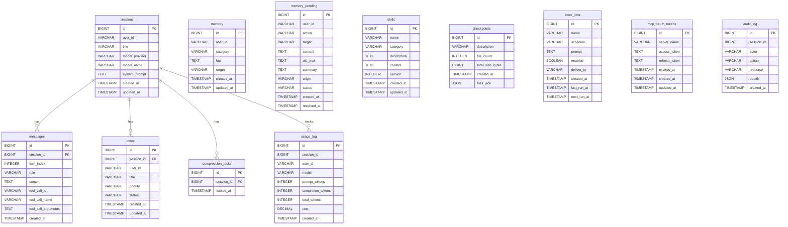

# Entity-Relationship Diagram

Database schema for the Java Agent platform, covering all 12 core tables defined in the migration DDL.

---

## ERD

---

## Relationship Summary

| Parent | Child | Cardinality | Description |
|---|---|---|---|
| sessions | messages | one-to-many | A session contains many conversation messages |
| sessions | todos | one-to-many | A session tracks many todo items |
| sessions | compression_locks | one-to-many | A session may hold compression locks per generation |
| sessions | usage_log | one-to-many | A session accumulates per-call usage/cost entries |

---

## Standalone Tables (No FK Relationships)

These tables are keyed by `user_id` or `server_name` rather than `session_id` and have no foreign-key relationship to `sessions`:

| Table | Keyed By | Purpose |
|---|---|---|
| memory | user_id | Persistent user-level memory facts |
| memory_pending | user_id | Staged memory changes awaiting reconciliation |
| skills | name (unique) | Skill definitions (prompts/workflows) |
| checkpoints | id | System-state snapshots for rollback |
| cron_jobs | name (unique) | Scheduled agent prompts |
| mcp_oauth_tokens | server_name | OAuth credentials for MCP tool servers |
| audit_log | session_id (nullable) | Compliance/security audit trail |