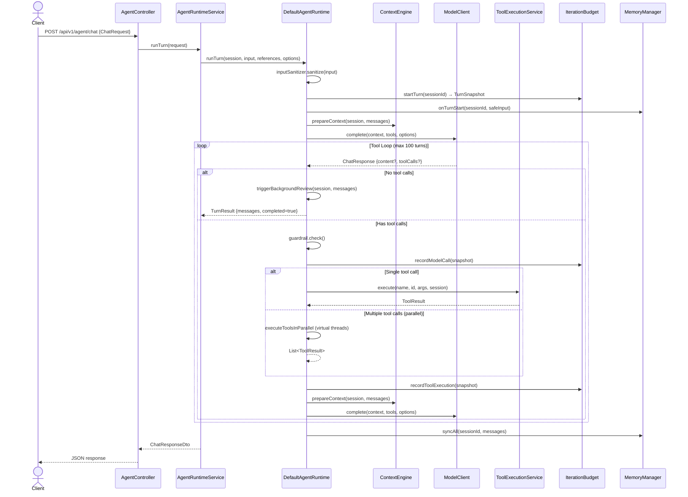
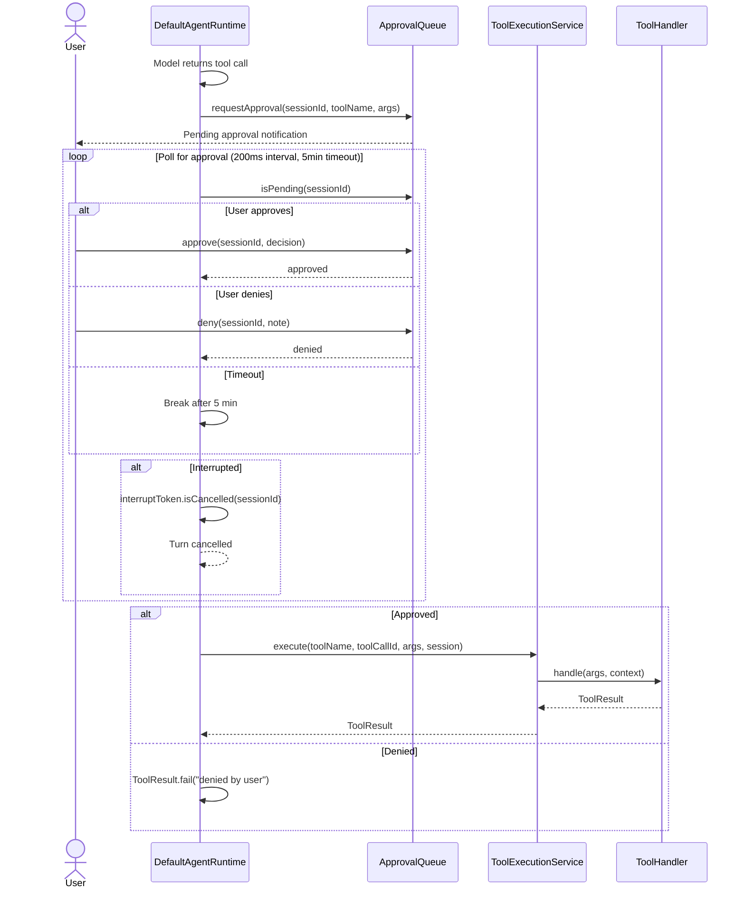
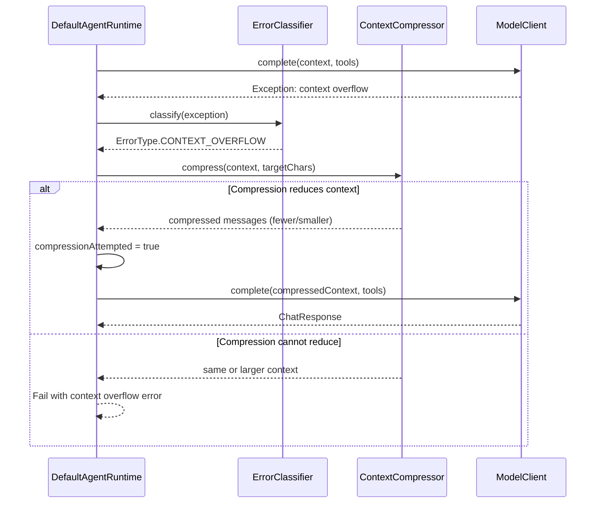
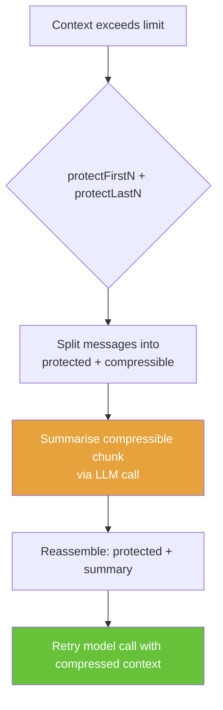
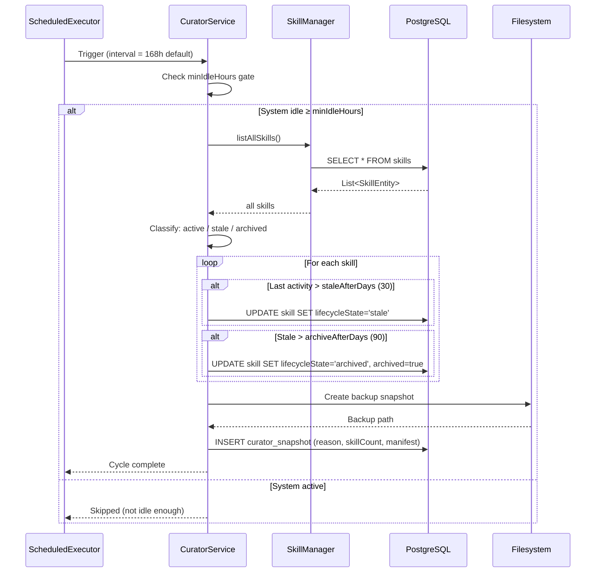
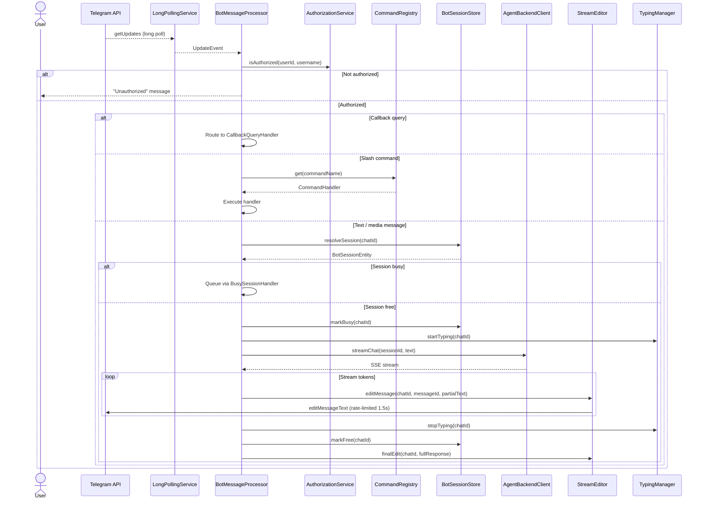
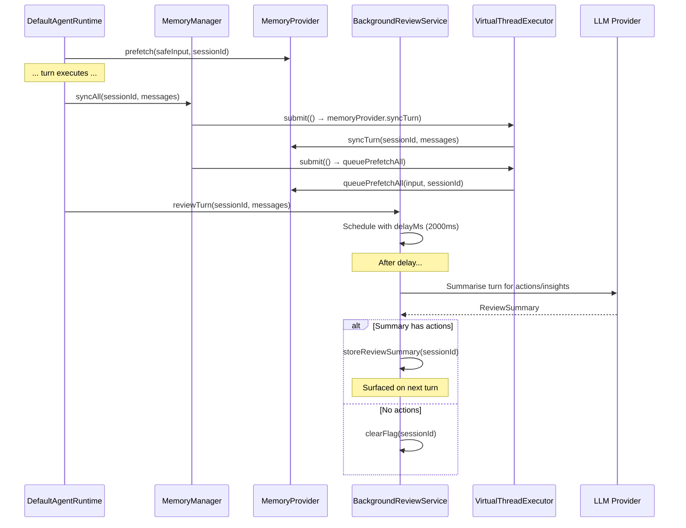
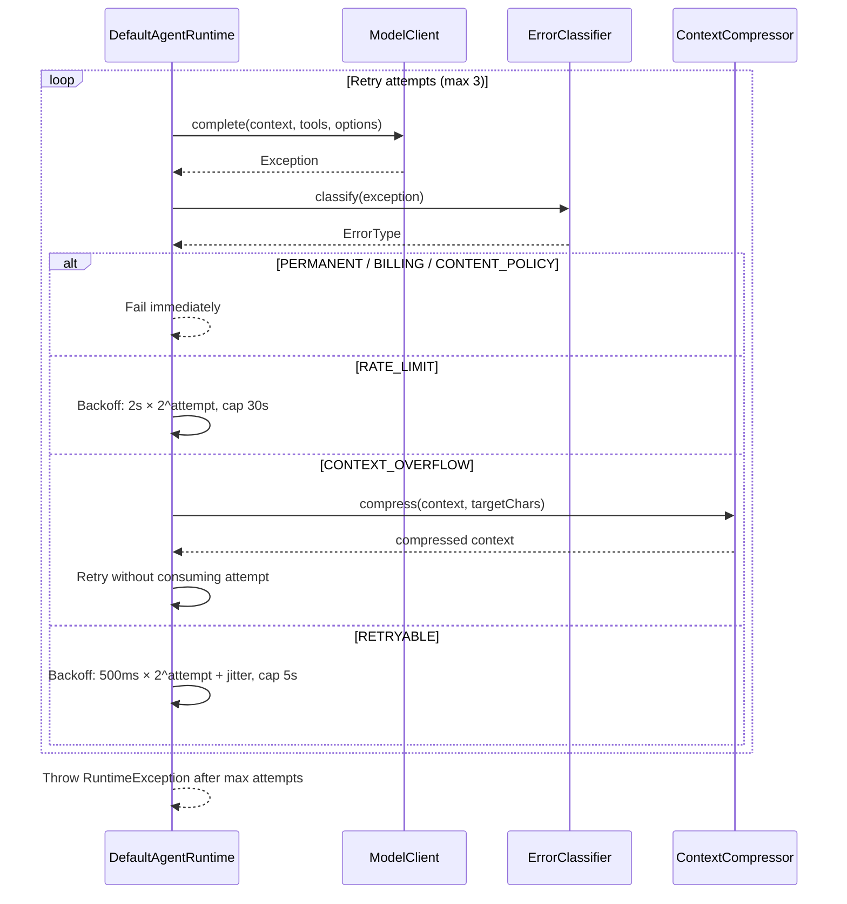

# Sequence Diagrams

> Key runtime flows in the Java Agent.
> All diagrams use Mermaid syntax.

---

## 1. Chat Turn (Non-Streaming)

A complete agent turn: user sends a message → model processes → tools execute → response returned.

---

## 2. Streaming Chat (SSE)

Real-time token-by-token output via Server-Sent Events.

```mermaid
sequenceDiagram
    actor Client
    participant AC as AgentController
    participant ASS as AgentStreamingService
    participant MC as ModelClient
    participant TE as ToolExecutionService
    participant DB as PostgreSQL

    Client->>AC: POST /api/v1/agent/chat/stream {ChatRequest}
    AC->>ASS: streamTurn(request)
    ASS-->>AC: SseEmitter (600s timeout)
    AC-->>Client: SSE stream opened

    ASS->>ASS: Load/create session via SessionRepository
    ASS->>MC: stream(messages, tools, handler)

    loop Token streaming
        MC-->>ASS: StreamEvent {type=CONTENT, text}
        ASS-->>Client: SSE: event=content, data="..."
    end

    alt Model requests tool calls
        MC-->>ASS: StreamEvent {type=TOOL_CALLS}
        ASS->>TE: execute(toolName, args, session)
        TE-->>ASS: ToolResult
        ASS-->>Client: SSE: event=tool_result, data="..."
        ASS->>MC: stream(continue with tool results)
    end

    MC-->>ASS: Stream complete
    ASS->>DB: Save messages (TransactionTemplate)
    ASS-->>Client: SSE: event=done, data=usage
    ASS->>ASS: SseEmitter.complete()
```

---

## 3. Tool Execution with Approval Gate

Destructive tools require user approval before execution.

---

## 4. Context Compression

When context exceeds token limits, the compressor summarises older messages.

### Compression Strategy

---

## 5. Curator Cycle

The curator runs periodically to maintain skill health (stale detection, archiving, backups).

---

## 6. Telegram Message Processing

From Telegram update to agent response delivery.

---

## 7. Memory Sync & Background Review

Memory is synced asynchronously after each turn; background review runs with a delay.

---

## 8. Model Call Retry with Error Classification

