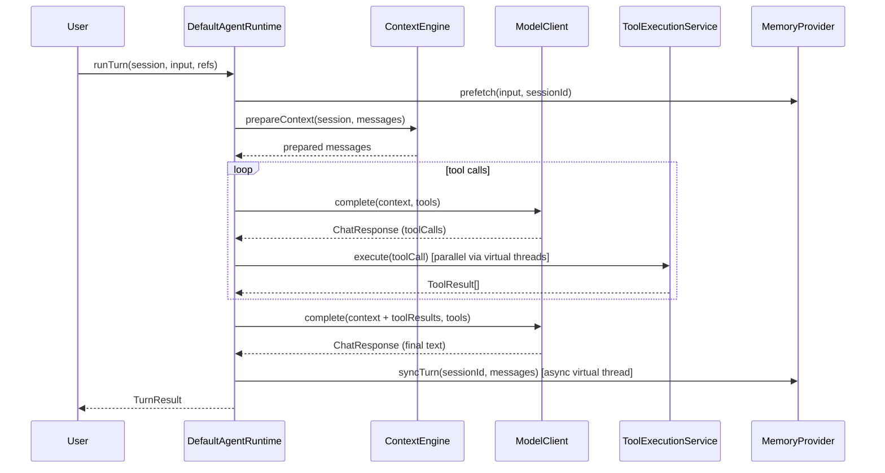
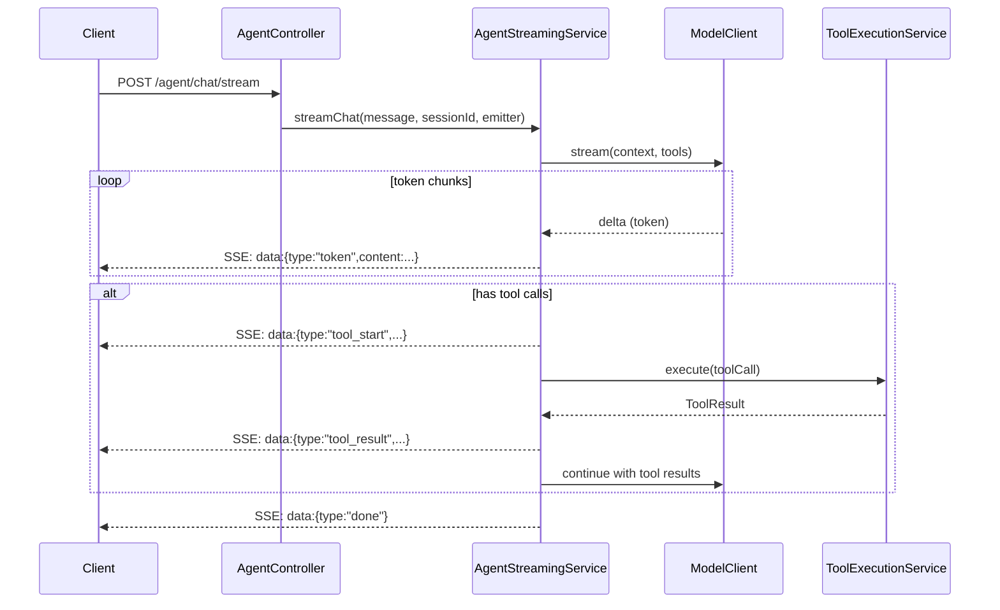
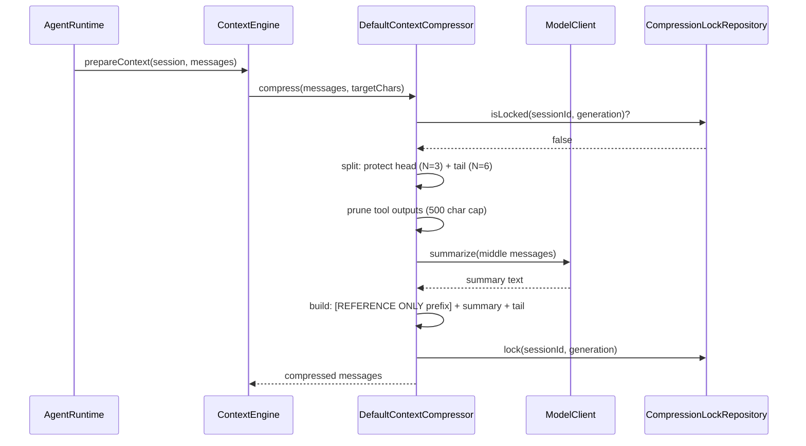
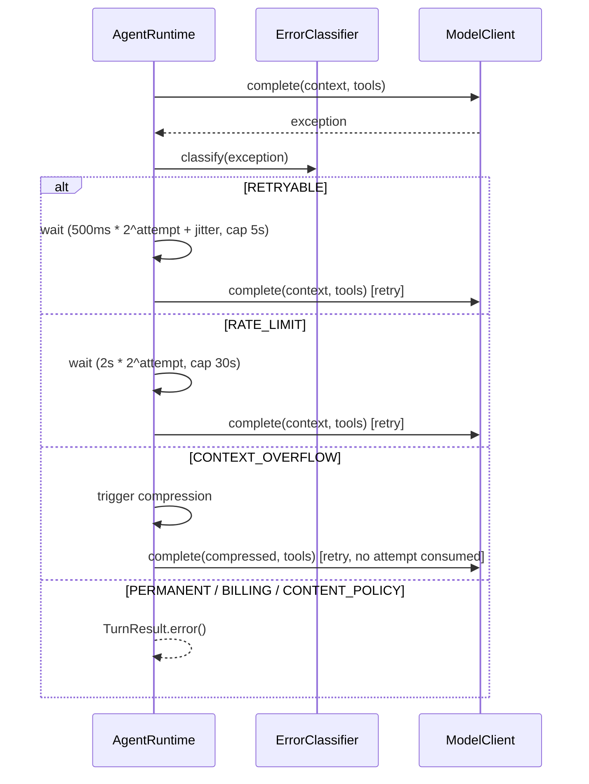
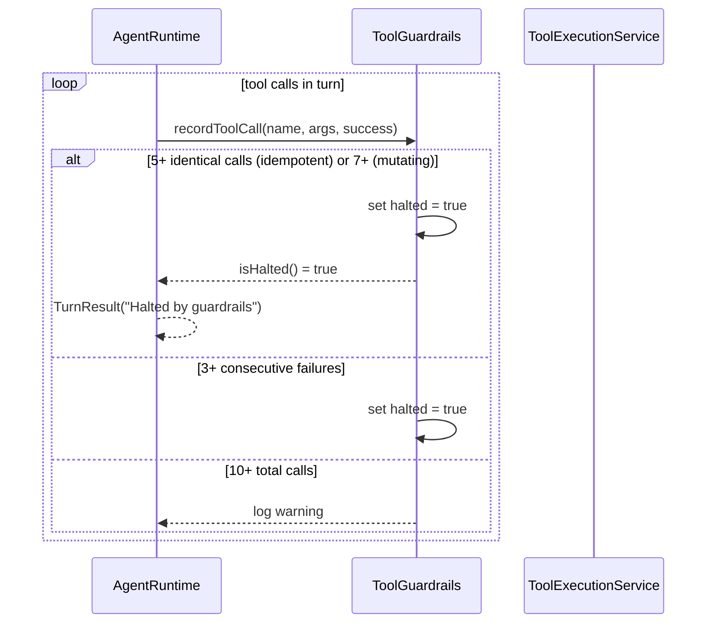
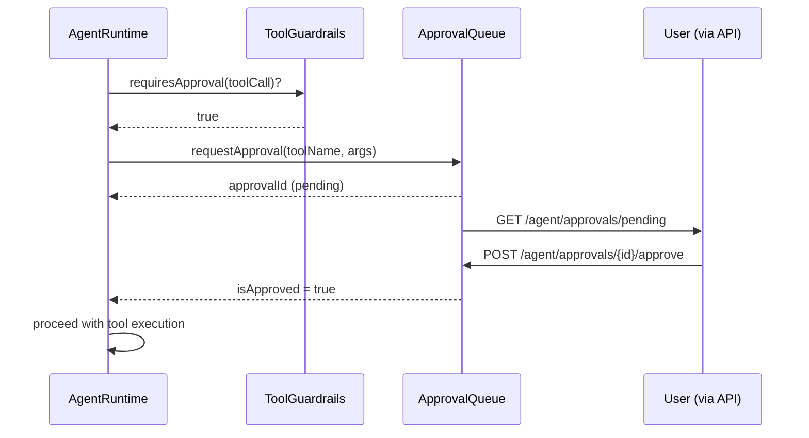

# Sequence Diagrams

Key runtime flows for the Java Agent platform, rendered as Mermaid sequence diagrams.

---

## 1. Conversation Loop (One Turn)

---

## 2. SSE Streaming

---

## 3. Context Compression

---

## 4. Model API Call Retry

---

## 5. Tool Loop Detection

---

## 6. Approval Flow

